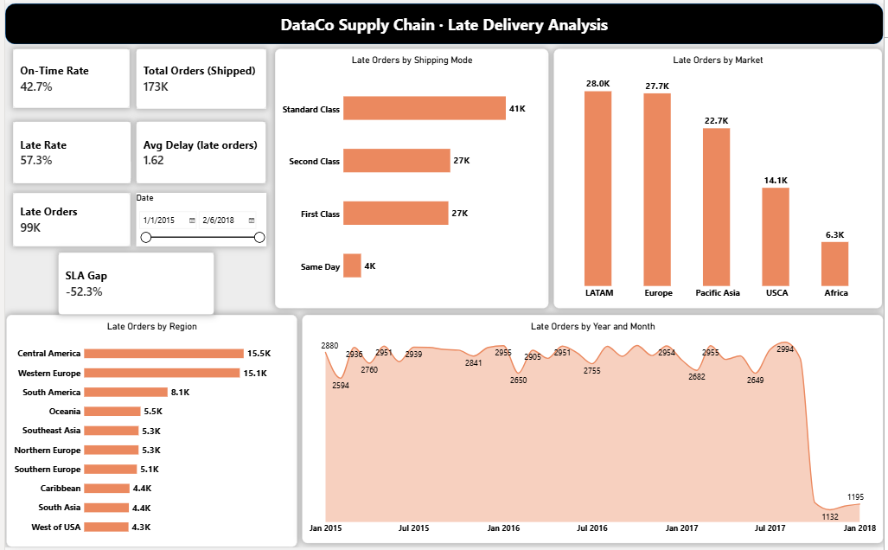
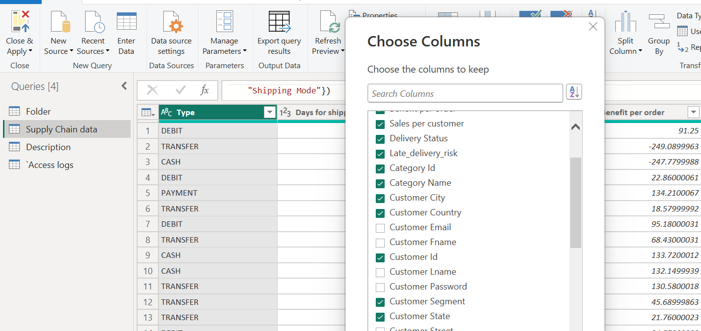
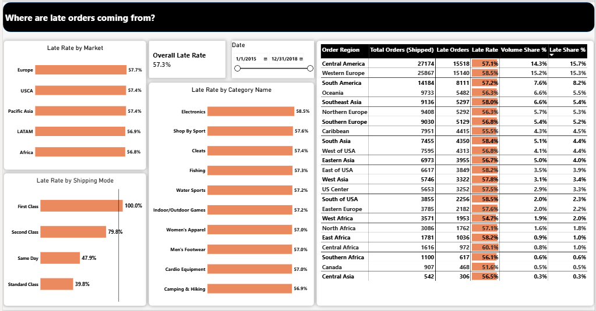
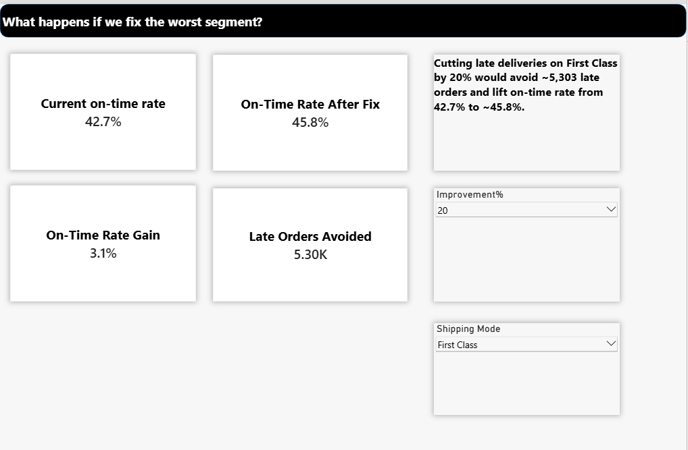

# Late Delivery Analysis — Supply Chain Performance

**Question:** Which parts of the fulfilment network drive late deliveries, and what would fixing them change?

**Finding:** First Class shipping has a 100% late rate against a 57.3% network average, despite being only 15.3% of shipped volume. Every First Class late order is exactly 1 day late, which points to a scheduling-rule error rather than a carrier or capacity problem.

**Recommendation:** Cutting First Class late deliveries by 20% would avoid 5,302 late orders and lift the network on-time rate from 42.7% to 45.8% (+3.1 percentage points).

---

## Context
Late deliveries cost more than a delayed parcel. They trigger SLA penalties, expediting costs and customer churn, and in a large network they are rarely spread evenly: a few shipping modes, regions or product lines usually account for a disproportionate share. This project looks for where those concentrations are, drawing on day-to-day experience monitoring fulfilment KPIs and SLA performance in logistics operations.

## Approach
- **Data:** DataCo Smart Supply Chain dataset (public, Kaggle): order-item level records covering orders, shipping, customers and products. 180,519 raw orders, 172,762 used in all rate and performance measures. Date range: January 2015 – January 2018 (37 months). See [`/data`](data/README.md).
- **Cancelled and fraud orders:** kept in the model, not deleted, but excluded at the measure level from all rate and performance calculations. Both `CANCELED` and `SUSPECTED_FRAUD` statuses map to a delivery status of "Shipping canceled" and never entered transit, so including them would count orders that were never shipped as on-time.
- **Cleaning (Power Query):** removed customer personal data and unused columns, parsed order and shipping dates with the correct (US) locale, set numeric types, and added a **DelayDays** column (actual shipping days − scheduled shipping days).

- **SLA target:** 95% on-time delivery. This is used as the benchmark throughout the analysis, reflecting common industry standards; the dataset does not specify an actual SLA. Current performance sits 52.3 percentage points below this target.
- **Key measures:** On-Time Rate, Late Rate, Late Orders, Avg Delay (late orders only), Total Orders (Shipped), Late Share % vs Volume Share % by segment, and a what-if model for improving the worst-performing shipping mode.

## Report Pages

| Page | Question it answers | Screenshot |
|---|---|---|
| Delivery Performance | Are we hitting SLA, and is it getting better or worse? | [view](screenshots/01-delivery-performance.png) |
| Root Cause | Which shipping modes, regions, markets and categories have the highest late rates? | [view](screenshots/02-root-cause.png) |
| Recommendation | What happens to on-time performance if the worst segment improves? | [view](screenshots/03-recommendation.png) |

**Delivery Performance** shows headline KPIs (on-time rate against the SLA target, late orders, average delay on late orders, total shipped orders), late orders by market and shipping mode, late orders by region, and a late-order trend over time.

**Root Cause** breaks late rate down by market, shipping mode and category, and ranks regions by how much more (or less) than their fair share of late orders they produce.

**Recommendation** models the effect of reducing the late rate on a chosen shipping mode by a chosen percentage, showing the on-time rate before and after and how many late orders would be avoided.

## Findings
1. **First Class shipping has a 100% late rate** vs. 57.3% network-wide (42.7% overall on-time rate). It makes up only 15.3% of shipped volume but 26.8% of all late orders, an 11.4-point overrepresentation, and every late order under this mode is exactly 1 day late, a pattern consistent with a scheduling-rule error rather than a carrier or capacity problem.
2. **Standard Class is the network's most reliable mode by a wide margin:** it makes up 59.7% of volume but only 41.4% of late orders, an 18.3-point underrepresentation. Market and product category show almost no disproportionality by comparison, all within ±0.2 points of their volume share, so the problem is concentrated in shipping mode, not geography or product mix.
3. **Second Class has a genuine operational delay**, averaging 1.99 days late with real spread (0–4 days). Standard Class, despite 39.8% of its orders being technically flagged late, averages −0.01 days, effectively on schedule.

## Recommendation
Cutting late deliveries on First Class by 20% would avoid 5,302 late orders and lift the network on-time rate from 42.7% to 45.8% (+3.1 percentage points). Because every First Class late order is exactly 1 day late with zero variance, this looks like a fixable scheduling parameter rather than a capacity or carrier issue, worth investigating before committing to a broader fix.

## Limitations
- The dataset is public and not from a named real network, so patterns illustrate the method rather than a specific business.
- Shipping days are recorded as whole days, so delays under a day aren't visible.
- There is no carrier-level field, so delays can be attributed to shipping mode and geography but not to individual carriers.
- The 100% late rate and zero-variance delay on First Class is a striking pattern; without access to the underlying scheduling logic, it's treated here as the most likely explanation rather than a confirmed root cause.

## Tools
Power BI Desktop (Power Query, DAX, what-if parameters)

## How to Open
The Power BI project file will be added once the full model export is ready.

---
**Author:** Oluchukwu Ejiofor · [Email](mailto:Oluchukwu.b.ejiofor@gmail.com)
